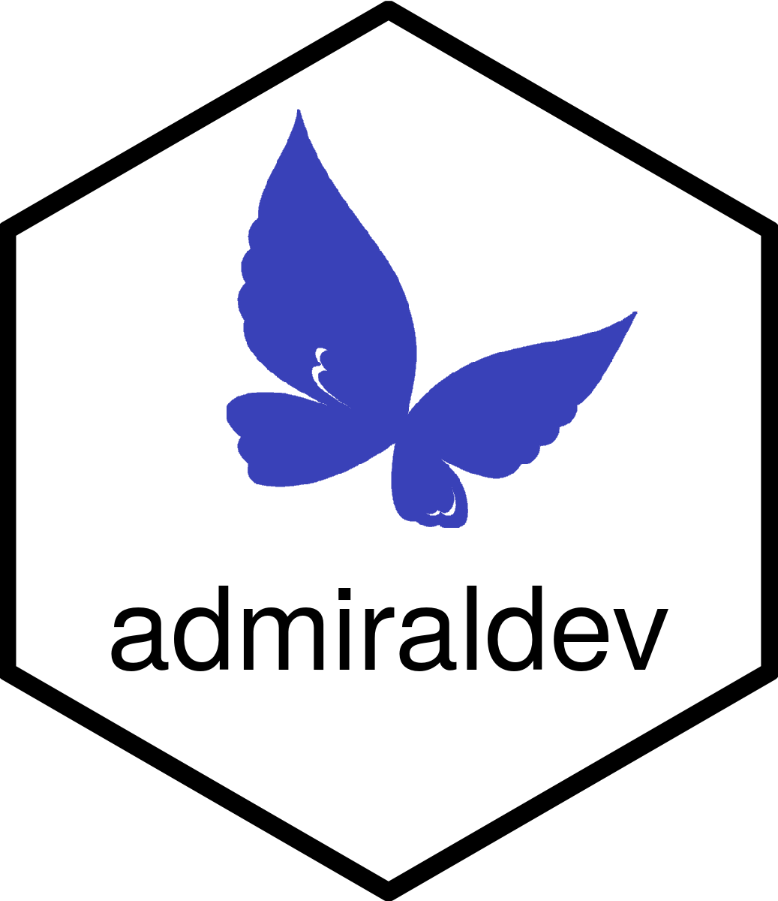

```{r setup, include=FALSE}
knitr::opts_chunk$set(echo = TRUE)
link <- function(text, url) {
  return(
    paste0(
      "[", text, "]",
      "(", url, ")"
    )
  )
}
dyn.link <- function(text, base_url, relative_url = "") {
  branch <- Sys.getenv("BRANCH_NAME", "main")
  return(
    link(
      text,
      paste(base_url, branch, relative_url, sep = "/")
    )
  )
}

# Other variables
admiral_homepage <- "https://pharmaverse.github.io/admiraldev"
```

<!-- Please do not edit the README.md file as it is auto-generated. Only edit the README.Rmd file -->

# admiraldev - ADaM in R Asset Library Development Utilities



<!-- badges: start -->
[](https://pharmaverse.org)
[](https://CRAN.R-project.org/package=admiral)
[](https://github.com/pharmaverse/admiraltemplate/actions/workflows/R-CMD-check.yml)
[](https://github.com/pharmaverse/admiraltemplate/actions/workflows/code-coverage.yml)
<!-- badges: end -->


## Purpose

Tools for developing functions and maintaining a healthly codebase within the family of admiral R packages.  

## Installation

The package is available from CRAN and can be installed by running `install.packages("admiral")`.

To install the latest development version of the package directly from GitHub use the following code:

```{r, eval = FALSE}
if (!requireNamespace("remotes", quietly = TRUE)) {
  install.packages("remotes")
}

remotes::install_github("pharmaverse/admiral.test", ref = "devel") # This is a required dependency of {admiral}
remotes::install_github("pharmaverse/admiral", ref = "devel")
remotes::install_github("pharmaverse/admiraldev", ref = "devel")
```
