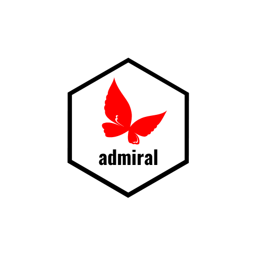

# admiral 

<!-- badges: start -->

[](https://pharmaverse.org)
[](https://CRAN.R-project.org/package=admiral)
[](https://github.com/pharmaverse/admiral/actions/workflows/code-coverage.yml)

<!-- badges: end -->

ADaM in R Asset Library

## Purpose

To provide an open source, modularized toolbox that enables the pharmaceutical programming community
to develop ADaM datasets in R.

## Installation

The package is available from CRAN and can be installed by running `install.packages("admiral")`.

To install the latest development version of the package directly from GitHub use the following code:

```r
if (!requireNamespace("remotes", quietly = TRUE)) {
  install.packages("remotes")
}

remotes::install_github("pharmaverse/admiral.test", ref = "devel") # This is a required dependency of {admiral}
remotes::install_github("pharmaverse/admiraldev", ref = "devel") # This is a required dependency of {admiral}
remotes::install_github("pharmaverse/admiral", ref = "devel")
```

## Release Schedule

`{admiral}` releases are targeted for the first Monday of the last month of each quarter.  Pull Requests will be frozen the week before a release.
The `admiral` family has several downstream and upstream dependencies and so this release shall be done in three
Phases:

* Phase 1 release is for `{admiraldev}` and `{admiral.test}`, which feed into all `admiral` packages
* Phase 2 release is only for core `{admiral}`
* Phase 3 release is extension packages, e.g. `{admiralonco}`

| Release Schedule | Phase 1- Date and Packages | Phase 2- Date and Packages | Phase 3- Date and Packages |
| ---------------- | -------------------------- | -------------------------- | -------------------------- |
| Q1-2023          | February 27th              | March 6th                  | March 13th                 |
|                  | `{admiraldev}`             | `{admiral}`                | `{admiralonco}`            |
|                  | `{admiral.test}`           |                            |                            |
| Q2-2023          | May 29th                   | June 5th                   | June 12th                  |
|                  | `{admiraldev}`             | `{admiral}`                | `{admiralonco}`            |
|                  | `{admiral.test}`           |                            |                            |

## Main Goal

Provide users with an open source, modularized toolbox with which to create ADaM datasets
in R. _As opposed to a “run 1 line and an ADaM appears” black-box solution or an attempt to
automate ADaM._

One of the key aspects of `{admiral}` is its development by the users for the users.
It gives an entry point for all to collaborate, co-create and contribute to a
harmonized approach of developing ADaMs in R across the pharmaceutical industry.

## Scope

To set expectations: It is not our target that `{admiral}` will ever provide all possible solutions
for all ADaM datasets outside of study specific needs. It depends on the user's collaboration
and contribution to help grow over time to an asset library that is robust, easy to use and
has an across-industry focus. We do not see a coverage of 100% of all ADaM derivations as ever
achievable---ADaM is endless.

We will provide:

* A toolbox of re-usable functions and utilities to create ADaM datasets using R scripts in a
  modular manner (an "opinionated" design strategy)
* Pharmaceutical communities and companies are encouraged to contribute to `{admiral}` following
  the provided programming strategy and modular approach
* Functions that are comprehensively documented and tested, including example calls---these are
  all listed in the [Reference section](https://pharmaverse.github.io/admiral/reference/index.html)
* Vignettes on how to create ADSL, BDS and OCCDS datasets, including example scripts
* Vignettes for ADaM dataset specific functionality (i.e. dictionary coding, date imputation,
  SMQs ...)

## Types of Packages

There will be 3 foreseeable types of `{admiral}` packages:

* Core package---one package containing all core functions required to create ADaMs,
  usable by any company (i.e. general derivations, utility functions and checks for ADSL, OCCDS and BDS)
* TA (Therapeutic Area) package extensions---one package per TA with functions that are
  specific to algorithms and requirements for that particular TA (e.g. [`{admiralonco}`](https://pharmaverse.github.io/admiralonco/index.html))
* Company package extensions---specific needs and plug-ins for the company, such as access to metadata
  (e.g. `{admiralroche}` or `{admiralgsk}`)

## Admiral Manifesto

For `{admiral}` and all extension packages, we prioritize providing our users with a __simple to adopt__ toolkit
that enables them to produce __readable__ and __easily constructible__ ADaM programs. The following explains
our philosophy, which we try to adhere to across the `{admiral}` family of packages.
There isn’t always a clear single, straightforward rule, but there are guiding principles we adhere to for `{admiral}`.
This manifesto helps show the considerations of our developers when making decisions.

We have four design principles to achieve the main goal:

### Usability

All `{admiral}` functions should be easy to use.

* Documentation is an absolute priority. Each function reference page should cover the purpose,
  descriptions of each argument with permitted values, the expected input and output, with clear real-life
  examples---so that users don’t need to dig through code to find answers.
* Vignettes that complement the functional documentation to help users see how best the functions can be
  applied to achieve ADaM requirements.
* Functions should be written and structured in a way that users are able to read, re-use or extend them
  for study specific purposes if needed (see Readability below).

### Simplicity

All `{admiral}` functions have a clear purpose.

* We try not to ever design single functions that could achieve numerous very different derivations. For
  example if you as a user pick up a function with >10 different arguments then chances are it is going to be
  difficult to understand if this function could be applied for your specific need. The intention is that
  arguments/parameters can influence how the output of a function is calculated, but not change the purpose of
  the function.

* We try to combine similar tasks and algorithms into one function where applicable to reduce the amount of repetitive functions with similar algorithms and to group together similar functionality to increase usability (e.g. one study day calculation rather than a function per variable).

* We strive to design functions that are not too general and trying to fulfil multiple, complex purposes.

* Functions should not allow expressions as arguments that are used as code snippets in function calls.

* We recommend to avoid copy and paste of complex computational algorithms or repetitive code like checks
  and advise to wrap them into a function. However we would also like to avoid multi-layered functional nesting,
  so this needs to be considered carefully to keep the nesting of 3-4 functions an exception rather than the rule.

### Findability

All `{admiral}` functions are easily findable.

* In a growing code base, across a family of packages, we make every effort to make our functions easily findable.
* We use consistent naming conventions across all our functions, and provide vignettes and ADaM templates that
  help users to get started and build familiarity. Each `{admiral}` family package website is searchable.
* We avoid repetitive functions that will do similar tasks (as explained above with study day example).
* Each package extension is kept focused on the specific scope, e.g. features that are relevant across multiple
  extension packages will be moved to the core `{admiral}` package.

### Readability

All `{admiral}` functions follow the [Programming Strategy](https://pharmaverse.github.io/admiraldev/main/articles/programming_strategy.html)
that all our developers and contributors must follow, so that all our code has a high degree of consistency and readability.

* We mandate use of tidyverse (e.g. dplyr) over similar functionality existing in base R.
* For sections of code that perform the actual derivations (e.g. besides assertions or basic utilities),
  we try to limit nesting of too many dependencies or functions.
* Modularity is a focus---we don’t try to achieve too many steps in one.
* All code has to be well commented.
* We recognize that a user or a Health Authority reviewer may have the wish to delve into the code base (especially
  given this open source setting), or users may need to extend/adapt the code for their study specific needs. We
  therefore want any module to be understandable to all, not only the `{admiral}` developers.

## References and Documentation

* Please go to [Get Started](https://pharmaverse.github.io/admiral/articles/admiral.html) section to start using `{admiral}`
* Please see the [pharmaverse YouTube channel](https://www.youtube.com/channel/UCxQFEv8HNqM01DXzdQLCy6Q) for videos related to `{admiral}`.
* Please see the [Programming Strategy](https://pharmaverse.github.io/admiraldev/main/articles/programming_strategy.html) to understand how functions are created
* Please see the [FAQ](https://pharmaverse.github.io/admiral/articles/faq.html) for the most frequent questions
* Please see the [Contribution Model](https://pharmaverse.github.io/admiral/articles/contribution_model.html) for how to get involved with making contributions
* Please see [FAQ: R and Package Versions](https://pharmaverse.github.io/admiral/articles/faq.html#why-do-we-use-a-certain-r-version-and-package-versions-for-development) for why we develop with certain R and package versions.

## Conference Presentations

* [R/Pharma 2021 talk](https://www.youtube.com/watch?v=N7Bw8c3D5fU) (recording)
* [PHUSE US Connect 2022 pharmaverse workshop](https://github.com/pharmaverse/pharmaverse.workshop.phuseUS2022) (slides and materials---including `{admiral}`
  workshop slides from PHUSE EU Connect 2021)

## Contact

We use the following for support and communications between user and developer community:

* [Slack](https://app.slack.com/client/T028PB489D3/C02M8KN8269)---for informal discussions, Q\&A and building our user community. If you don't have access, use this [link](https://join.slack.com/t/pharmaverse/shared_invite/zt-yv5atkr4-Np2ytJ6W_QKz_4Olo7Jo9A) to join the pharmaverse Slack workspace
* [GitHub Issues](https://github.com/pharmaverse/admiral/issues)---for direct feedback, enhancement requests or raising bugs
