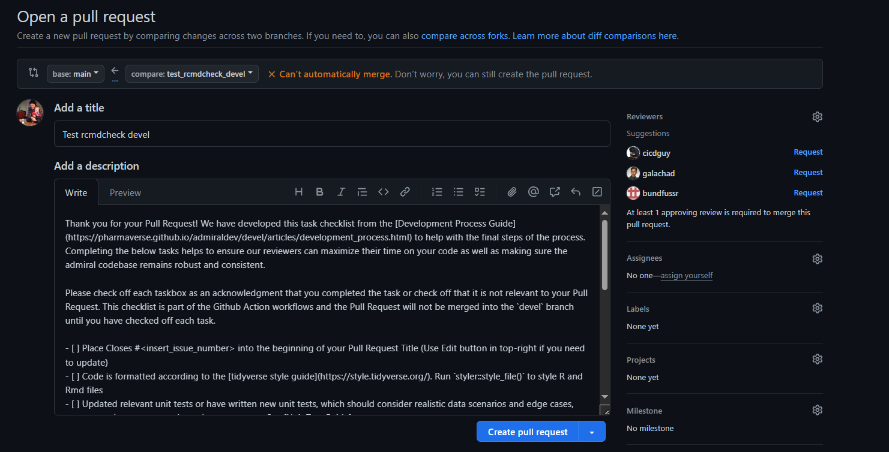
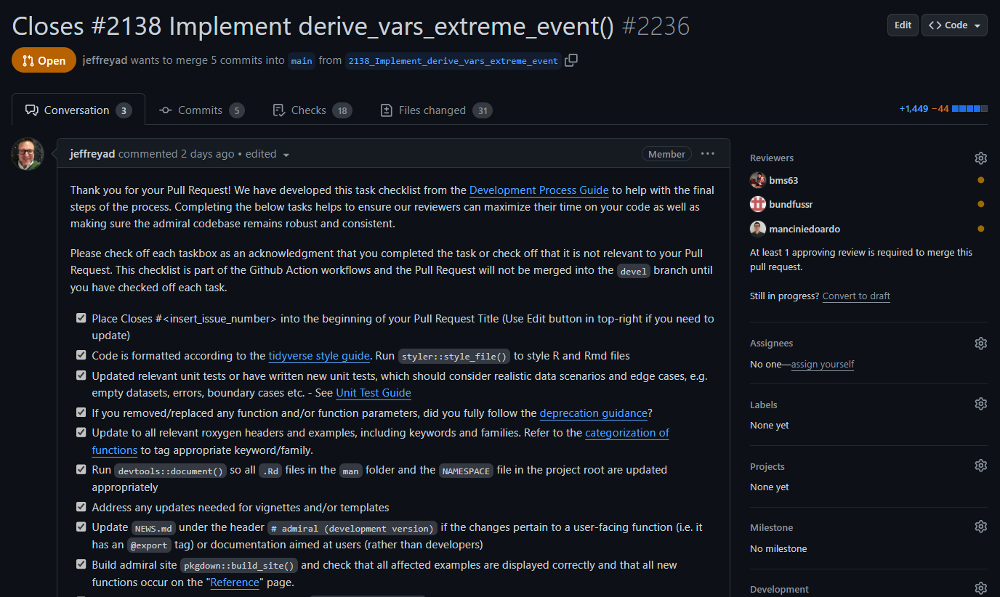

```{r, include = FALSE}
knitr::opts_chunk$set(
  collapse = TRUE,
  comment = "#>"
)
```

# Introduction

This document is intended to be guidance for creators and reviewers of pull requests (PRs) in the `{admiral}` package. PR authors will benefit from shorter review times by closely following the guidance provided here.


# Review Criteria

For a pull request to be merged into `devel` it needs to pass the automated `R CMD check`, `lintr`, and `task-list-completed` workflows on GitHub at a minimum. The first two checks can  be run locally using the `devtools::check()` and `lintr::lint_package()` commands and are recommended to be done before pushing to GitHub. The `task-list-completed` workflow is exclusive to GitHub and will be discussed later. In addition, the PR creator and reviewer should make sure that

- the [Programming Strategy](programming_strategy.html) and [Development Process](development_process.html) are followed

- the function is ADaM IG compliant

- the function does what is intended for (as described in the header and corresponding issue)

- the function header properly explains the intention of the function, the expected inputs (incl. permitted values of parameters) and the output produced; after reading the documentation the reader should be able to predict the output of the function without having to read the source code

- the function has an accompanying set of unit tests; for derivations these unit test should have a code coverage of at least 90%; the whole package should have a coverage of >= 80%

- the implemented derivation is in the scope of `{admiral}`, e.g. does not expect company specific input or hard-code company-specific rules

- meaningful error or warning messages are issued if the input is invalid

- documentation is created/updated by running `devtools::document()`

- functions which are supposed to be exported are listed in the `NAMESPACE` file; this requires an `@export` tag in the function header

- examples print relevant source variables and newly created variables and/or records in their output

- the `NEWS.md` file is updated with an entry that explains the new features or changes

- the author of a function is listed in the `DESCRIPTION` file

- all files affected by the implemented changes, e.g. vignettes and templates, are updated


# So much Red Tape!

The `{admiral}` development team is aware and sympathetic to the great many checks, processes and
documents needed to work through in order to do a compliant Pull Request. The `task-list-completed` GitHub
workflow was created to help reduce this burden on contributors by providing a standardized checklist that compiles information from the Pull Request Review Guidance, [Programming Strategy](programming_strategy.html) and [Development Process](development_process.html) vignettes. 

The next three sections give a high-level overview of what a contributor faces in opening a PR, and how a contributor interacts with the `task-list-completed` workflow in their PR.

## Open a Pull Request

When a contributor opens a Pull Request a lengthy standard text will be inserted into the comment section.  Please do not alter any of the automated text. You are free to add in additional textual information, screenshots, etc at the top of the automated text if needed to clarify or contribute to the discussion around your Pull Request. 


```{r echo=FALSE, out.width='120%'}

```

## Create a Pull Request

After you click the green `Create pull request` button the automated text that was inserted will be turned into a checklist in your Pull Request. Each check box has been drawn from the previously mentioned vignettes and presented in the recommended sequence.  These check boxes are meant to be a helpful aid in ensuring that you have created a compliant Pull Request. 

```{r echo=FALSE, out.width='120%'}

```

## Complete all checks

The check boxes are linked to the `task-list-completed` workflow.  You need to check off each box in acknowledgment that you have done you due diligence in creating a compliant Pull Request. GitHub will refresh the Pull Request and trigger `task-list-completed` workflow that you have completed the task.  The PR can not be merged into `devel` until the contributor has checked off each of the check box items.  

```{r echo=FALSE, out.width='120%'}
knitr::include_graphics('./pr_review_actions.png')
```

Please don't hesitate to reach out to the `{admiral}` team on [Slack](https://app.slack.com/client/T028PB489D3/C02M8KN8269) or through the [GitHub Issues](https://github.com/pharmaverse/admiral/issues) tracker if you think this checklist needs to be amended or further clarity is needed on a check box item. 


# Common R CMD Check Issues

`R CMD check` is a command line tool that checks R packages against a standard set of criteria. For a pull request to pass the check must not issue any notes, warnings or errors. Below is a list of common issues and how to resolve them.

## Check Fails Only on One Version

If the `R CMD check` workflow fails only on one or two R versions it can be helpful to reproduce the testing environment locally. The test environment for R version 3.6 is the same we use for development.

To reproduce the R version 3.5 environment open the `{admiral}` project in R version 3.5.x, comment the line `source("renv/activate.R")` in the `.Rprofile` file, restart the R session and then run the following commands in the R console.

```r
install.packages("remotes")
options(repos = "https://cran.microsoft.com/snapshot/2018-12-20/")
remotes::install_deps(dependencies = TRUE)
devtools::check()
```

To reproduce the R release version environment open the `{admiral}` project in the latest available R version, comment the line `source("renv/activate.R")` in the `.Rprofile` file, restart the R session and then run the following commands in the R console.

```r
install.packages("remotes")
options(repos = "https://packagemanager.rstudio.com/cran/__linux__/focal/latest")
remotes::install_deps(dependencies = TRUE)
devtools::check()
```

## Package Dependencies

```
> checking package dependencies ... ERROR
  Namespace dependency not required: ‘pkg’
```

Add `pkg` to the `Imports` or `Suggests` field in the `DESCRIPTION` file. In general, dependencies should be listed in the `Imports` field. However, if a package is only used inside vignettes or unit tests it should be listed in `Suggests` because all `{admiral}` functions would work without these "soft" dependencies being installed.

## Global Variables

```
❯ checking R code for possible problems ... NOTE
  function_xyz: no visible binding for global variable ‘some_var’
```

Add `some_var` to the list of "global" variables in `R/globals.R`.

## Undocumented Function Parameter

```
❯ checking Rd \usage sections ... WARNING
  Undocumented arguments in documentation object 'function_xyz'
    ‘some_param’
```

Add an `@param some_param` section in the header of `function_xyz()` and run `devtools::document()` afterwards.

## Outdated Documentation

```
❯ checking for code/documentation mismatches ... WARNING
  Codoc mismatches from documentation object 'function_xyz':
  ...
  Argument names in code not in docs:
    new_param_name
  Argument names in docs not in code:
    old_param_name
  Mismatches in argument names:
    Position: 6 Code: new_param_name Docs: old_param_name
```

The name of a parameter has been changed in the function code but not yet in the header. Change `@param old_param_name` to `@param new_param_name` and run `devtools::document()`.
