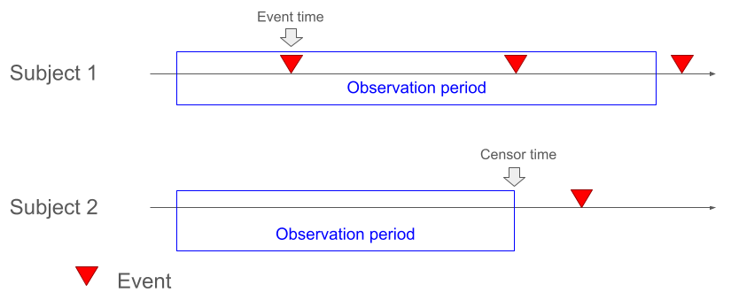
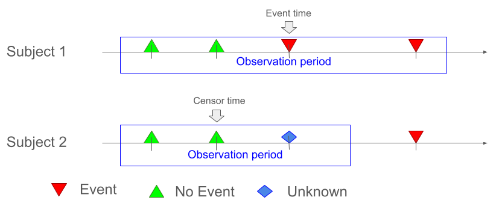
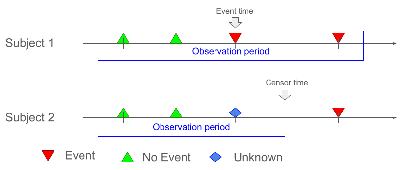

```{r setup, include = FALSE}
knitr::opts_chunk$set(
  collapse = TRUE,
  comment = "#>"
)

library(admiraldev)
library(admiral)
library(tibble)
library(lubridate)
library(dplyr)
library(ggplot2)
library(ggnewscale)
# create some test data
adsl <- tribble(
  ~USUBJID, ~TRTSDT,           ~TRTEDT,
  "001",    ymd("2020-01-01"), ymd("2020-03-23"),
  "002",    ymd("2020-01-02"), ymd("2020-03-03"),
  "003",    ymd("2020-01-03"), ymd("2020-02-22"),
  "004",    ymd("2020-01-04"), ymd("2020-04-18")
) %>%
  mutate(
    STUDYID = "XY1234"
  )

adqs_all <- bind_rows(
  tribble(
    ~USUBJID, ~AVISIT,    ~AVAL,
    "001",    "BASELINE",    76,
    "001",    "WEEK 4",      80,
    "001",    "WEEK 8",      88,
    "001",    "WEEK 12",     65,
    "002",    "BASELINE",    87,
    "002",    "WEEK 4",      65,
    "002",    "WEEK 8",      67,
    "003",    "BASELINE",    66,
    "003",    "WEEK 4",      NA,
    "003",    "WEEK 8",      83,
    "004",    "BASELINE",    72,
    "004",    "WEEK 4",      85,
    "004",    "WEEK 8",      83,
    "004",    "WEEK 12",     62,
    "004",    "WEEK 16",     60
  ) %>%
    mutate(
      PARAMCD = "A",
      PARAM = "Score A"
    ),
  tribble(
    ~USUBJID, ~AVISIT,    ~AVAL,
    "001",    "BASELINE",    56,
    "001",    "WEEK 4",      51,
    "001",    "WEEK 8",      NA,
    "001",    "WEEK 12",     65,
    "002",    "BASELINE",    68,
    "002",    "WEEK 4",      57,
    "002",    "WEEK 8",      81,
    "003",    "BASELINE",    66,
    "003",    "WEEK 4",      77,
    "003",    "WEEK 8",      79,
    "004",    "BASELINE",    72,
    "004",    "WEEK 4",      60,
    "004",    "WEEK 8",      83,
    "004",    "WEEK 12",     82,
    "004",    "WEEK 16",     79
  ) %>%
    mutate(
      PARAMCD = "B",
      PARAM = "Score B"
    )
) %>% 
  mutate(
    STUDYID = "XY1234",
    AVISITN = case_when(
      AVISIT == "BASELINE" ~ 0,
      AVISIT == "WEEK 4" ~ 4,
      AVISIT == "WEEK 8" ~ 8,
      AVISIT == "WEEK 12" ~ 12,
      AVISIT == "WEEK 16" ~ 16,
      TRUE ~ NA_real_
    ),
    ABLFL = if_else(AVISIT == "BASELINE", "Y", NA_character_)
  ) %>%
  derive_var_base(by_vars = exprs(USUBJID, PARAMCD)) %>%
  derive_var_chg() %>%
  mutate(
    CHGCAT1 = case_when(
      CHG <= -10 ~ "WORSENED",
      CHG > -10 & CHG < 10 ~ "UNCHANGED",
      CHG >= 10 ~ "IMPROVED",
      TRUE ~ NA_character_
    )
  ) %>%
  derive_vars_merged(
    dataset_add = adsl,
    by_vars = exprs(USUBJID, STUDYID)
  ) %>%
  mutate(
    ADT = TRTSDT + AVISITN * 7,
    ANL01FL = if_else(ADT <= TRTEDT, "Y", NA_character_)
  ) %>%
  derive_vars_dy(reference_date = TRTSDT, source_vars = exprs(ADT, TRTSDT, TRTEDT)) %>% 
  arrange(USUBJID, PARAMCD, AVISITN)

  adqs_a <- filter(adqs_all, PARAMCD == "A")
```

```{r, echo=FALSE}
plot_data <- function(dataset, dataset_tte = NULL) {
  
  if (length(unique(dataset$PARAMCD)) == 1) {
  final_plot <- ggplot(dataset) +
    theme_classic() +
    theme(
      axis.line.y = element_blank()
    ) +
    labs(
      y = "Subject",
      x = "Time"
    ) +
    geom_rect(
      aes(
        y = USUBJID,
        height = 0.5,
        xmin = TRTSDY,
        xmax = TRTEDY,
        fill = "Observation Period",
        color = "Observation Period"
      ),
      alpha = 0.5, inherit.aes = FALSE
    ) +
    scale_fill_manual(
      name = NULL,
      values = c("Observation Period" = "lightyellow")
    ) +
    scale_color_manual(
      name = NULL,
      values = c("Observation Period" = "yellow")
    ) +
    guides(
      fill = guide_legend(order = 2),
      color = guide_legend(order = 2)
    ) +
    new_scale_color() +
    new_scale_fill() +
    geom_point(
      aes(
        x = ADY,
        y = USUBJID,
        color = CHGCAT1,
        shape = CHGCAT1,
        fill = CHGCAT1
      ),
      size = 3
    ) +
    scale_shape_manual(
      name = "Change from baseline",
      values = c("IMPROVED" = 24, "UNCHANGED" = 21, "WORSENED" = 25), na.value = 13
    ) +
    scale_color_manual(
      name = "Change from baseline",
      values = c("IMPROVED" = "darkgreen", "UNCHANGED" = "blue", "WORSENED" = "red"), na.value = "grey"
    ) +
    scale_fill_manual(
      name = "Change from baseline",
      values = c("IMPROVED" = "darkgreen", "UNCHANGED" = "blue", "WORSENED" = "red")
    ) +
    scale_x_continuous(
      breaks = seq(1, 120, by = 28),
      labels = c("Baseline", "Week 4", "Week 8", "Week 12", "Week 16")
    ) +
    scale_y_discrete(limits = rev(levels(as.factor(dataset$USUBJID)))) +
    guides(
      fill = guide_legend(order = 1),
      color = guide_legend(order = 1),
      shape = guide_legend(order = 1)
    )
  } else {
    final_plot <- ggplot(dataset) +
      theme_classic() +
      theme(
        strip.background = element_blank(),
        axis.line.y = element_blank()
      ) +
      labs(
        y = NULL,
        x = "Time"
      ) +
      geom_rect(
        aes(
          y = PARAM,
          height = 0.7,
          xmin = TRTSDY,
          xmax = TRTEDY,
          fill = "Observation Period",
          color = "Observation Period"
        ),
        alpha = 0.5, inherit.aes = FALSE
      ) +
      scale_fill_manual(
        name = NULL,
        values = c("Observation Period" = "lightyellow")
      ) +
      scale_color_manual(
        name = NULL,
        values = c("Observation Period" = "yellow")
      ) +
      guides(
        fill = guide_legend(order = 2),
        color = guide_legend(order = 2)
      ) +
      new_scale_color() +
      new_scale_fill() +
    geom_point(
      aes(
        x = ADY,
        y = PARAM,
        color = CHGCAT1,
        shape = CHGCAT1,
        fill = CHGCAT1
      ),
      size = 3
    ) +
    scale_shape_manual(
      name = "Change from baseline",
      values = c("IMPROVED" = 24, "UNCHANGED" = 21, "WORSENED" = 25), na.value = 13
    ) +
    scale_color_manual(
      name = "Change from baseline",
      values = c("IMPROVED" = "darkgreen", "UNCHANGED" = "blue", "WORSENED" = "red"), na.value = "grey"
    ) +
    scale_fill_manual(
      name = "Change from baseline",
      values = c("IMPROVED" = "darkgreen", "UNCHANGED" = "blue", "WORSENED" = "red")
    ) +
    scale_x_continuous(
      breaks = seq(1, 120, by = 28),
      labels = c("Baseline", "Week 4", "Week 8", "Week 12", "Week 16")
    ) +
    scale_y_discrete(limits = rev(levels(as.factor(dataset$PARAM)))) +
    guides(
      fill = guide_legend(order = 1),
      color = guide_legend(order = 1),
      shape = guide_legend(order = 1)
    ) +
    facet_wrap(vars(paste("Subject", USUBJID)), ncol = 1)
  }
  
  if (!is.null(dataset_tte)) {
    dataset_tte <- dataset_tte %>% derive_vars_dy(
      reference_date = STARTDT,
      source_vars = exprs(ADT)
    )
    
    if (length(unique(dataset$PARAMCD)) == 1) {
      final_plot <- final_plot +
        coord_cartesian(clip = "off") +
        geom_segment(
          data = dataset_tte,
          aes(
            x = ADY,
            xend = ADY,
            y = as.numeric(rev(levels(as.factor(USUBJID)))) + 0.4,
            yend = as.numeric(rev(levels(as.factor(USUBJID)))) + 0.1
          ),
          inherit.aes = FALSE,
          arrow = arrow(type = "closed", length = unit(0.1, "inches"))
        ) +
        geom_text(
          data = dataset_tte,
          aes(
            x = ADY,
            y = USUBJID,
            label = if_else(CNSR == 0, "Event time", "Censoring time")
          ),
          hjust = "center",
          nudge_y = 0.5,
          inherit.aes = FALSE
        )
    } else {
      final_plot <- final_plot +
        coord_cartesian(clip = "off") +
        geom_segment(
          data = dataset_tte,
          aes(
            x = ADY,
            xend = ADY,
            y = -0.7,
            yend = 0.4
          ),
          inherit.aes = FALSE,
          arrow = arrow(type = "closed", length = unit(0.07, "inches"))
        ) +
        geom_text(
          data = dataset_tte,
          aes(
            x = ADY,
            y = -0.2,
            label = if_else(CNSR == 0, "Event time", "Censoring time")
          ),
          hjust = "left",
          nudge_x = 1.5,
          inherit.aes = FALSE
        )
    }
  }

  final_plot
}
```

# Introduction

The basic concept of preparing data for time-to-event analyses is quite simple:

- we need to know whether the event occurred or not
- if it did, the first time when it occurred is set as the _event time_
- if it did not, the last time when it is known that the subject didn't had an
event is set as the _censoring time_.

Depending on the definition of the event and the collection of the data, the
creation of a time-to-event ADaM dataset can be more or less complex. In this
vignette, we will discuss different scenarios and how to derive the essential
variables `CNSR` and `ADT`. For a complete programming workflow see the
[Creating a BDS Time-to-Event ADaM](bds_tte.html) vignette.

# Observation Period

The observation period is the time during which the subjects are at risk of
experiencing the event. Usually it starts at the beginning of the treatment. The
end of the observation period is study- or analysis-specific. It may be derived
from more than one date, e.g., the end of the treatment plus a fixed time, the
end of the study, death, the start of an alternative treatment, ...

The records of the input datasets need to be restricted to the observation
period. This can be done by deriving `ANLzzFL` variables in the input datasets
and then filtering the records based on these flags.

Another option is to use the `end_dates` argument of the `derive_param_tte()`
function to specify the dates which restrict the observation period. The input
records are then automatically restricted to records before the specified end
dates.

# Scenarios

There are three main scenarios to consider when deriving time-to-event datasets:

## Continuous Assessments

The simplest case are events which are assessed continuously, e.g., death or
adverse events. These can occur at any time within the observation period. It is
assumed that the event didn't occur if no event is recorded. In this case, the
event time is the time of the first occurrence of the event and the censoring
time is the end of the observation period.

```{r out.width = '70%', echo = FALSE}

```


## Discrete Assessments, Negative Event

Many events require dedicated assessments to determine whether the event
occurred or not, e.g., lab assessments, tumor assessments, questionnaires, etc.
I.e., information about the event is available only at these time points and it
may happen that for some assessments it is unknown if the event occurred or not,
e.g., tumor scans were not readable or the score couldn't be calculated because
too few questions were answered. In this case, the event time is the time of the
first assessment where the event is recorded. For the censoring time it depends
on the type of the event. If the event is a negative event like death,
worsening, adverse event, ..., the most conservative approach is to ignore time
points where it is not known if the event occurred. I.e., the censoring time is
set to the time of the last assessment where it is known that the event didn't
occur.

```{r out.width = '70%', echo = FALSE}

```

For the examples, we will use the following questionnaire ADaM dataset. The
variable `CHGCAT1` indicates whether the subject worsened, improved, or was
unchanged compared to baseline. For some records it is unknown whether the
subject worsened or not.

<details>
<summary>`adqs_a` dataset</summary>
```{r, echo=FALSE}
dataset_vignette(
  adqs_a,
  display_vars = exprs(USUBJID, AVISIT, AVAL, CHG, CHGCAT1, ADT, ANL01FL)
)
```
</details>

```{r, echo=FALSE}
plot_data(adqs_a)
```

A "time to worsening" parameter is derived by using `derive_param_tte()`. By
default a negative event is assumed, thus the `event_type` argument doesn't need
to be specified.

```{r}
trt_end <- censor_source(
  dataset_name = "adsl",
  date = TRTEDT
)

worsening <- event_source(
  dataset_name = "adqs",
  filter = CHGCAT1 == "WORSENED",
  date = ADT
)

valid_assessment <- censor_source(
  dataset_name = "adqs",
  filter = !is.na(CHGCAT1),
  date = ADT,
  order = exprs(PARAMCD)
)

adtte <- derive_param_tte(
  dataset_adsl = adsl,
  source_datasets = list(adsl = adsl, adqs = adqs_a),
  end_dates = list(trt_end),
  event_conditions = list(worsening),
  censor_conditions = list(valid_assessment),
  set_values_to = exprs(
    PARAMCD = "TTWORS",
    PARAM = "Time to worsening"
  )
)
```

<details>
<summary>`adtte` dataset</summary>
```{r, echo=FALSE}
dataset_vignette(adtte)
```
</details>

```{r, echo=FALSE}
plot_data(adqs_a, dataset_tte = adtte)
```

## Discrete Assessments, Positive Event

For positive events like improvement, response, ..., the most conservative
approach is to set the censoring time to the end of the observation period, even
if it is not known whether the event occurred or not at this time point.

```{r out.width = '70%', echo = FALSE}

```

For positive events, the `event_type` argument of the `derive_param_tte()`
function can be set to `"positive"`.

```{r}
improvement <- event_source(
  dataset_name = "adqs",
  filter = CHGCAT1 == "IMPROVED",
  date = ADT
)

adtte <- derive_param_tte(
  dataset_adsl = adsl,
  source_datasets = list(adsl = adsl, adqs = adqs_a),
  end_dates = list(trt_end),
  event_type = "positive",
  event_conditions = list(improvement),
  censor_conditions = list(valid_assessment),
  set_values_to = exprs(
    PARAMCD = "TTIMPR",
    PARAM = "Time to improvement"
  )
)
```

<details>
<summary>`adtte` dataset</summary>
```{r, echo=FALSE}
dataset_vignette(adtte)
```
</details>

```{r, echo=FALSE}
plot_data(adqs_a, dataset_tte = adtte)
```

# Events Considering more than one Assessment

For some events it is necessary to consider more than one assessment. For
example, improvement or worsening could require a confirmation at a subsequent
assessment.

`derive_param_tte()` doesn't allow to consider subsequent records to decide
whether an event occurred or not. Thus the confirmation information needs to be
derived in the input dataset, e.g., by deriving a variable or a parameter which
indicates whether the event is confirmed or not. Then this variable or parameter
can be used in the `derive_param_tte()` function to select the event records.

## Adding a Confirmation Flag to the Source Dataset

To derive a variable (`CONFFL`) which indicates whether the worsening or
improvement is confirmed or not, the `derive_var_joined_exist_flag()` function
can be used. Here an assessment is considered as confirmed if it doesn't change
at the next visit. Only assessments within the treatment period (`ANL01FL ==
"Y"`) are considered for the confirmation.

```{r}
adqs_ext <- adqs_a %>%
  derive_var_joined_exist_flag(
    dataset_add = adqs_a,
    filter_add = ANL01FL == "Y",
    by_vars = exprs(USUBJID),
    new_var = CONFFL,
    tmp_obs_nr_var = tmp_obs_nr,
    join_vars = exprs(CHGCAT1),
    join_type = "after",
    order = exprs(AVISITN),
    filter_join = CHGCAT1 %in% c("IMPROVED", "WORSENED") & CHGCAT1 == CHGCAT1.join &
      tmp_obs_nr + 1 == tmp_obs_nr.join
  )
```

<details open>
<summary>`adqs_ext` dataset</summary>
```{r, echo=FALSE}
dataset_vignette(
  adqs_ext,
  display_vars = exprs(USUBJID, AVISIT, CHGCAT1, ANL01FL, CONFFL)
)
```
</details>

The new variable `CONFFL` is then used in the definition of the event for
confirmed worsening.
```{r}
confirmed_worsening <- event_source(
  dataset_name = "adqs",
  filter = CHGCAT1 == "WORSENED" & CONFFL == "Y",
  date = ADT
)

adtte <- derive_param_tte(
  dataset_adsl = adsl,
  source_datasets = list(adsl = adsl, adqs = adqs_ext),
  end_dates = list(trt_end),
  event_conditions = list(confirmed_worsening),
  censor_conditions = list(valid_assessment),
  set_values_to = exprs(
    PARAMCD = "TTCWORS",
    PARAM = "Time to confirmed worsening"
  )
)
```

<details>
<summary>`adtte` dataset</summary>
```{r, echo=FALSE}
dataset_vignette(adtte)
```
</details>

```{r, echo=FALSE}
plot_data(adqs_ext, dataset_tte = adtte)
```

## Adding a Confirmation Parameters to the Source Dataset

TODO: add example for time to confirmed worsening using a confirmed worsening parameter.

## Using `derive_extreme_event()` to Derive Confirmation and Time-to-Event in One Step

Another option is to use `derive_extreme_event()` with `event_joined()` objects
to derive the time-to-event parameter. This has the advantage that the input
dataset doesn't need to be modified but it has the disadvantage that the results
are harder to review and trace back. E.g., in the example below, the assessments
which are considered confirmed are derived within the `derive_extreme_event()`
function, i.e., they are not accessible for reviewers or for debugging.

```{r}
adtte <- derive_extreme_event(
  by_vars = exprs(USUBJID),
  source_datasets = list(adqs = filter(adqs_a, ANL01FL == "Y")),
  tmp_event_nr_var = tmp_event_nr,
  order = exprs(tmp_event_nr, ADT),
  mode = "first",
  events = list(
    event_joined(
      description = "Confirmed worsening event",
      dataset_name = "adqs",
      order = exprs(AVISITN),
      join_vars = exprs(CHGCAT1),
      join_type = "after",
      condition = CHGCAT1 == "WORSENED" & CHGCAT1.join == "WORSENED",
      keep_source_vars = exprs(ADT, TRTSDT, TRTEDT, STUDYID),
      set_values_to = exprs(CNSR = 0)
    ),
    event(
      description = "Censoring at last valid assessment",
      dataset_name = "adqs",
      condition = !is.na(CHGCAT1),
      keep_source_vars = exprs(ADT, TRTSDT, TRTEDT, STUDYID),
      order = exprs(ADT),
      mode = "last",
      set_values_to = exprs(CNSR = 1)
    )
  ),
  set_values_to = exprs(
    PARAMCD = "TTCWORS",
    PARAM = "Time to confirmed worsening",
    STARTDT = TRTSDT
  )
)
```

<details>
<summary>`adtte` dataset</summary>
```{r, echo=FALSE}
dataset_vignette(adtte)
```
</details>

```{r, echo=FALSE}
plot_data(adqs_a, dataset_tte = adtte)
```


# Combined Events

Some events are defined by a combination of more than one event, e.g., for
progression free survival the event is defined as progression _or_ death.
For these events which are combined by "or" separate `event_source()` objects
can be created for each event and then specified for the `event_conditions`
argument of `derive_param_tte()`. For events which are combined by "and" or more
complex combinations, a variable or parameter indicating whether the combined
event occurred or not needs to be derived in the input dataset.

## Events Combined by "or"

Assume we want to derive a time to improvement parameter which requires
improvement in score A or score B.

<details>
<summary>`adqs_all` dataset</summary>
```{r, echo=FALSE}
dataset_vignette(
  adqs_all,
  display_vars = exprs(USUBJID, AVISIT, PARAMCD, AVAL, CHG, CHGCAT1, ADT, ANL01FL)
)
```
</details>

```{r, echo=FALSE}
plot_data(adqs_all)
```

We define the events for improvement in score A and score B separately and then specify both events for the `event_conditions` argument of `derive_param_tte()`.

```{r}
improvement_a <- event_source(
  dataset_name = "adqs",
  filter = CHGCAT1 == "IMPROVED" & PARAMCD == "A",
  date = ADT
)

improvement_b <- event_source(
  dataset_name = "adqs",
  filter = CHGCAT1 == "IMPROVED" & PARAMCD == "B",
  date = ADT
)

adtte <- derive_param_tte(
  dataset_adsl = adsl,
  source_datasets = list(adsl = adsl, adqs = adqs_all),
  end_dates = list(trt_end),
  event_type = "positive",
  event_conditions = list(improvement_a, improvement_b),
  censor_conditions = list(valid_assessment),
  set_values_to = exprs(
    PARAMCD = "TTIMPR",
    PARAM = "Time to improvement"
  )
)
```

<details>
<summary>`adtte` dataset</summary>
```{r, echo=FALSE}
dataset_vignette(adtte)
```
</details>

```{r, echo=FALSE}
plot_data(adqs_all, dataset_tte = adtte)
```

## Events Combined by "and"

If events are combined by "and", e.g., score 1 improved _and_ score 2 didn't
worsen, a variable or parameter needs to be derived in the input dataset which
indicates whether the combined event occurred or not. To derive a new parameter
the `derive_param_computed()` function can be used (use `derive_var_computed()`
for deriving a new variable):
```{r}
adqs_all_ext <- adqs_all %>%
  derive_param_computed(
    by_vars = exprs(STUDYID, USUBJID, AVISIT, AVISITN, ADT, ADY, TRTSDT, TRTEDT),
    parameters = c("A", "B"),
    set_values_to = exprs(
      AVALC = if_else(
        CHGCAT1.A == "IMPROVED" & CHGCAT1.B %in% c("IMPROVED", "UNCHANGED"),
        "Y",
        NA_character_
      ),
      PARAMCD = "IMPROVE",
      PARAM = "Improvement in score A and stable score B"
    )
  )
```

<details>
<summary>`adqs_all_ext` dataset</summary>
```{r, echo=FALSE}
dataset_vignette(adqs_all_ext)
```
</details>

Now the new parameter can be used in the `derive_param_tte()` function to select
the event records.
```{r}
improvement_ab <- event_source(
  dataset_name = "adqs",
  filter = AVALC == "Y" & PARAMCD == "IMPROVE",
  date = ADT
)

adtte <- derive_param_tte(
  dataset_adsl = adsl,
  source_datasets = list(adsl = adsl, adqs = adqs_all_ext),
  end_dates = list(trt_end),
  event_type = "positive",
  event_conditions = list(improvement_ab),
  censor_conditions = list(valid_assessment),
  set_values_to = exprs(
    PARAMCD = "TTIMPRAB",
    PARAM = "Time to improvement in score A and stable score B"
  )
)
```

<details>
<summary>`adtte` dataset</summary>
```{r, echo=FALSE}
dataset_vignette(adtte)
```
</details>

```{r, echo=FALSE}
plot_data(adqs_all, dataset_tte = adtte)
```

# Differentiate Censoring

TODO: Setting `EVNTDESC` for censoring is sometimes tricky. For example if you
are deriving time to `CHG >= 10` and want to distinguish subjects censored
because they don't have a baseline value and subject censored because they don't
have post-baseline values.
