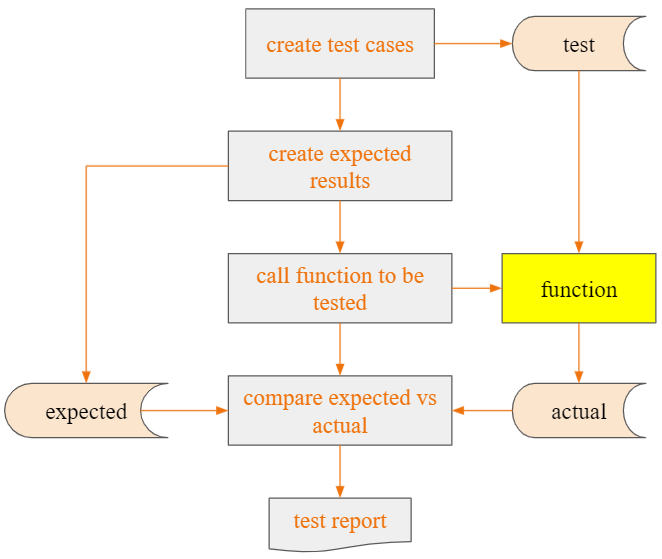

```{r setup, include = FALSE}
knitr::opts_chunk$set(
  collapse = TRUE,
  comment = "#>"
)
```


# Why Write Unit Tests?

## Unit Tests Become a Safety Net for Developers

A comprehensive suite of unit tests can act as a safety net for developers. By 
frequently running the tests, they can assure their recent modifications to the 
code haven’t broken anything. In other words, unit tests help prevent regressions.

## Unit Tests Can Contribute to Higher Code Quality

Since unit tests act as a safety net, developers become more confident when 
changing the code. They can refactor the code without fear of breaking things, 
driving the general quality of the code base up.

## Unit Tests Can Contribute to Better Application Architecture

If you can add unit tests easily to a code base, that’s usually a good sign 
regarding the quality of the app’s architecture. So, the drive to write testable
code can be an incentive for better architecture.

## Detects Code Smells in your Codebase

If ease of adding unit tests to a code base is a good sign, the opposite is also
true. Having a hard time creating unit tests for a given piece of code might be 
a sign of code smells in the code—e.g. functions that are too complex.

# Writing Good Unit Tests

## Tests Should Be Fast

If they’re slow, developers won’t run them as often as they should. That defeats
the whole purpose of having a suite of unit tests in the first place, which is 
to boost the developers’ confidence to make changes to the code. The tests can’t
work as the safety net if they’re not run often.

## Tests Should Be Simple

There are several techniques we can apply to have a high degree of confidence in
the correctness of our tests. One of those is to keep your tests with low 
cyclomatic complexity. Cyclomatic complexity is a code metric that indicates the
number of possible execution paths a given method can follow. A piece of code 
with lower complexity is easier to understand and maintain, which means developers 
are less likely to introduce bugs when working on it. We can measure the 
cyclomatic complexity of your tests (using, for instance, a linter tool) and do 
your best to keep it low.

## Test Shouldn’t Duplicate Implementation Logic

If the same person wrote both the test and the implementation, it’s possible they
made the same errors in both places. Since the tests mirror the implementation,
they might still pass, and the implementation could be wrong, but the tests might
fool you into thinking otherwise. Resist the urge to make your tests fancy, keep
them simple, and your testing suite will be better for it.

## Tests Should Be Readable

This best practice overlaps a little bit with the one about keeping your tests 
simple. If tests are hard to read, developers are more likely to misunderstand 
them and introduce bugs. Test cases could be used as a form of documentation, so
they obviously need to be readable.

## Running Unit Tests Part of the Build Process

Automate the whole process of running the unit tests and taking some action when
they fail. Your build process should execute your unit tests and mark the build 
as broken when the tests fail.

# Writing Unit Tests in {admiral}

## Plan your Unit Tests

Start by considering the derivation rule you are testing and the possible 
arguments/flexibilities of your function code. Then plan which scenarios you will
test. These can either involve generating different input test cases or feeding 
them into different calls of your function.

## Test coverage

Unit tests should cover the functionality of the function.
If another function `g()` is called within a function `f()`, the unit tests of `f()` should not test the functionality of `g()`. 
This should be tested by the unit tests of `g()`, i.e. unit tests should be added at the lowest level.

## Tests Should be Robust to Cover Realistic Data Scenarios

For generating input test cases, it can be helpful to consider regular cases 
(expected common data scenarios), boundary cases (where data points are close or
equal), and special cases (uncommon but valid data scenarios, e.g. missing or 
special characters). Although you will never cover every single eventuality of 
possible input data (no reliability testing method ever gives 100% certainty), 
you do need to give confidence that the code is robust enough to work across most
data scenarios.

## Testing Should Cover Possible Arguments

For the different calls of your function, consider how the user might apply your
function and test a variety of possible calls, whilst still remembering the tips
above that tests should be fast and simple. 
This is only needed in cases where the complexity and level of flexibility of 
your function justifies it, e.g. see the test script: https://github.com/pharmaverse/admiral/blob/main/tests/testthat/test-derive_var_extreme_flag.R.

## Exported Functions

Don’t forget to add a unit test for each exported function.

## Set up the Test Script

Within {admiral} folder https://github.com/pharmaverse/admiral/tree/main/tests/testthat, 
add a script with the naming convention “test-\<script_containing_function\>.R”.,
the unit test script can be created from the console also, as follows: 

```
usethis::use_test("<script_containing_function>")
```
the testing framework used is testthat and has the following format :

```
test_that("<function_name> Test 1: <Explanation of the test>", {
  library(tibble)
  
  input <- tribble(
    ~inputvar1, ~inputvar2, ...
    <Add Test Data Scenarios>
    ...
  )

  expected_output <- mutate(input, outputvar = c(<Add Expected Outputs>))

  expect_dfs_equal(<function name>(input), expected_output)
  
})
```

For example, if you are testing a function called my_new_func that is contained 
in script all_funcs.R then from console use:

```
usethis::use_test("all_funcs")
```

Open the newly created file "test-all_funcs.R" and use the following format:

```
test_that("my_new_func Test 1: <Explanation of the test>", {
  library(tibble)
  
  input <- tribble(
    ~inputvar1, ~inputvar2, ...
    <Add Test Data Scenarios>
    ...
  )

  expected_output <- mutate(input, outputvar = c(<Add Expected Outputs>))

  expect_dfs_equal(<function name>(input), expected_output)
})
```
**Note**: When comparing datasets in {admiral} we use function `expect_dfs_equal()`. 

The input and expected output for the unit tests must follow the following rules:

* Input and output should be as simple as possible.
* Values should be hard-coded whenever possible.
* If values need to be derived, only unit tested functions can be used.

If a dataset needs to be created for testing purpose, it should be done so using the function `tribble()` (specify `library(tibble)` before calling this function). 
Make sure to align columns as well. This ensures quick code readability.

Ensure you give a meaningful explanation of the test in the testthat call, as 
these will be compiled in the package validation report. Having the name of the
function and test ID included in title will also help with traceability.

Once you have tested your unit test program, you can run all unit tests from
the console, as follows.

```
devtools::test()
```

## Automation of Unit Tests

When a user actions a pull request in {admiral} GitHub repo, the unit tests are 
automatically run and pull request will be denied if any unit tests fail.

## Flow Chart

```{r echo=FALSE, out.width='120%'}

```
